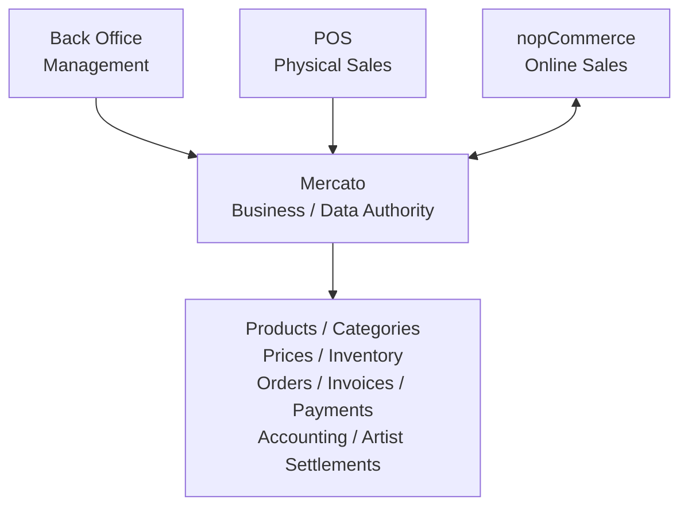
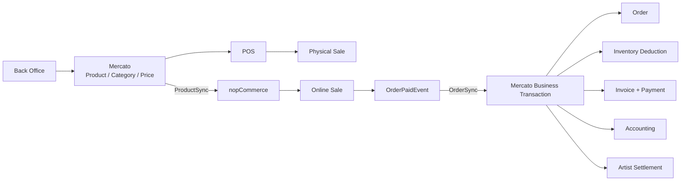
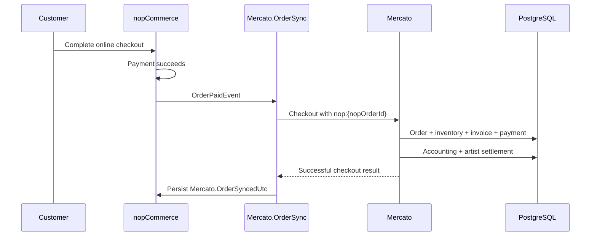
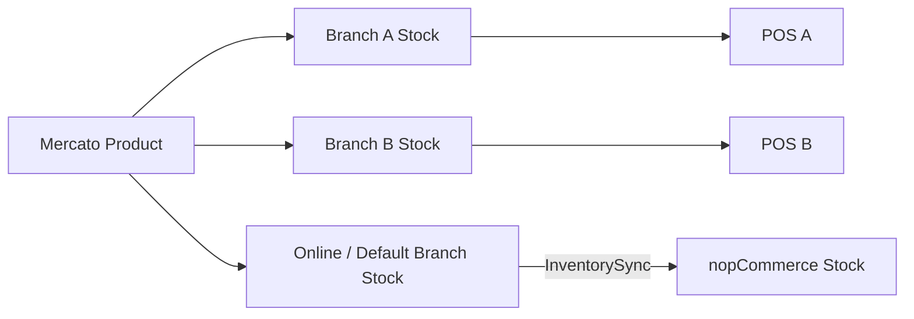
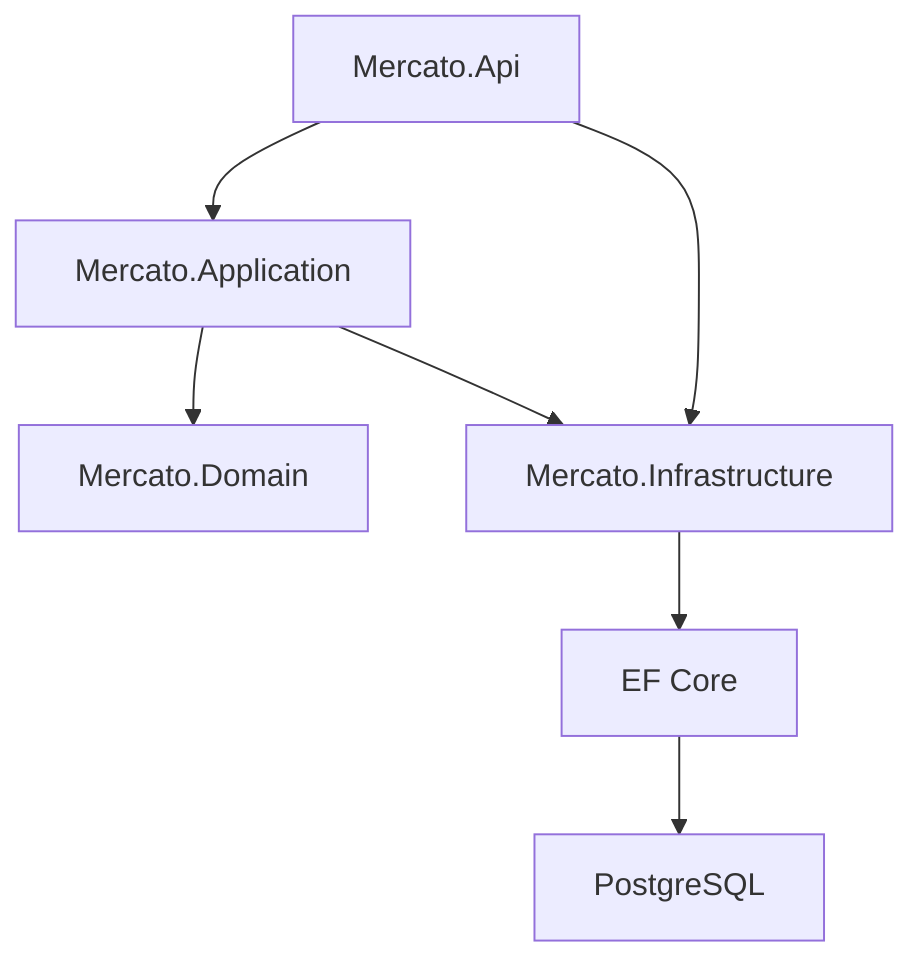

# Mercato Platform

Mercato is a multi-branch retail ERP and commerce platform for managing one business across physical stores and an online storefront.

Mercato is the **business and data authority**. The Back Office manages the business, the Mercato POS sells in physical stores, and nopCommerce 4.90.7 provides the online storefront and checkout experience.

## Platform at a glance



The core rule is simple: **business data is defined in Mercato and consumed by the sales channels**.

- **Back Office** manages products, categories, artists, branches, customers, inventory, staff, settings, invoices, settlements and reporting.
- **POS** sells Mercato products from authorized physical branches and writes completed sales/returns back into Mercato.
- **nopCommerce** displays synchronized Mercato products online, handles storefront/cart/checkout/payment/shipping concerns, and sends paid orders back to Mercato.

## Product and online-sale flow

Products are created and maintained in Mercato. They do not normally need to be recreated manually in nopCommerce.



### Mercato → nopCommerce

The integration synchronizes Mercato-owned commerce data into nopCommerce:

- products and categories;
- product names and authoritative sale prices;
- Mercato product identity, stored in nopCommerce as `Mercato.ProductId`;
- branch-specific available stock through InventorySync.

Product synchronization uses the Mercato SKU when available. If a product has no SKU, the integration uses a stable fallback in the form `MERCATO-{ProductId:N}`.

### nopCommerce → Mercato

When a nopCommerce order becomes paid, `Mercato.OrderSync` sends the sale into Mercato. Mercato then performs the authoritative business transaction: stock deduction, order/invoice/payment persistence, accounting capture and artist-settlement creation.

Online-order synchronization uses the stable idempotency key `nop:{nopOrderId}`. Successful synchronization is marked durably in nopCommerce so a retry cannot create the same Mercato sale twice.



## Inventory model

Mercato is the inventory authority. Stock belongs to branches and is derived from the inventory movement ledger.



For nopCommerce, the Connector can define a default Mercato branch. Scheduled InventorySync publishes availability for that branch. A storefront customer can also have a selected Mercato branch through the BranchSelector integration; paid-order synchronization resolves the selected branch when available and otherwise falls back to the Connector default branch.

This keeps online and physical sales inside the same Mercato inventory model instead of maintaining a separate e-commerce stock authority.

## Responsibilities

### Mercato owns

- product and category master data;
- authoritative sale and purchase prices;
- artists and purchase-cost artist settlement;
- branches and staff-to-branch access;
- inventory ledger, adjustments and transfers;
- customers;
- POS sales and returns;
- authoritative business orders and invoices;
- payment records and accounting events;
- application/business settings.

### nopCommerce owns

- storefront presentation;
- SEO and product-page presentation concerns;
- cart and checkout UI;
- online payment gateways;
- shipping providers and shipping UI;
- standard nopCommerce customer/storefront behavior.

nopCommerce is therefore an online commerce channel connected to Mercato, not a second independent ERP.

## Architecture

```text
Mercato.Platform/
├── backend/
│   ├── migration-smoke.sh
│   └── src/
│       ├── Mercato.Api
│       ├── Mercato.Application
│       ├── Mercato.Domain
│       └── Mercato.Infrastructure
├── frontend/
│   ├── admin/                 Back Office HTML entry
│   ├── pos/                   POS HTML entry
│   ├── public/                locales, favicon, login art, licensed-font hook
│   └── src/
│       ├── admin.tsx          Back Office React application
│       ├── pos.tsx            POS React application
│       ├── shared.tsx         shared API/auth/UI components
│       ├── persian.tsx        Jalali datetime control
│       └── styles.css         responsive design system
├── integrations/
│   └── nopCommerce/           nopCommerce 4.90.7 integration/plugins
├── tests/
├── docs/
│   ├── Mercato.Platform.Specification.md
│   └── PRODUCTION-READINESS.md
├── docker-compose.yml
└── docker-compose.production.yml
```

### Backend

The backend uses ASP.NET Core, EF Core and PostgreSQL with a consolidated Clean Architecture structure:



### Frontend

The operator UI is **React + TypeScript + Vite**. Docker builds the frontend and copies `frontend/dist` into the ASP.NET runtime `wwwroot`, so the deployed Mercato application serves the API and operator applications from one origin.

Public application routes are:

```text
/           workspace launcher
/admin/     Back Office
/pos/       Point of Sale
/health     service health endpoint
```

Back Office routes are real SPA paths such as `/admin/products`, `/admin/invoices` and `/admin/settings`; direct refreshes are supported by API fallback routing.

## Back Office

The responsive Back Office provides operational management for:

- products, categories and product media;
- artists and artist goods receipts;
- branches and customers;
- branch inventory availability, adjustments, transfers and movement history;
- invoices and invoice reprinting;
- order lookup;
- artist settlements;
- accounting reporting;
- Admin/Manager/Cashier staff management and branch assignments;
- application, authentication, payment-method and discount settings.

Admin authorization and Manager/Cashier branch restrictions are enforced server-side; hiding UI controls is never treated as the security boundary.

## POS

The responsive POS is the physical-store sales client of Mercato. It supports:

- authorized-branch selection;
- branch catalog and current availability;
- optional product images;
- cart management;
- configured payment methods and discounts;
- customer lookup and fast registration by mobile;
- atomic and idempotent checkout;
- printable receipt data;
- order lookup;
- partial returns/refunds with over-return prevention.

A POS checkout writes the complete Mercato business transaction atomically, including order, inventory movements, invoice, payment, accounting, artist settlement and idempotency state.

## nopCommerce 4.90.7 integration

The supported e-commerce target is exactly **nopCommerce 4.90.7 (`release-4.90.7`) on .NET 9** unless a separately tested upgrade is approved.

The integration contains a shared Mercato core plus five native nopCommerce plugins:

| Component | Responsibility |
| --- | --- |
| `Mercato.NopCommerce.Core` | Shared Mercato HTTP contracts/client and synchronization support |
| `Mercato.Connector.Plugin` | Mercato connection/settings and shared client registration |
| `Mercato.ProductSync.Plugin` | Mercato product/category/price → nopCommerce product catalog |
| `Mercato.InventorySync.Plugin` | Mercato branch availability → nopCommerce stock quantity |
| `Mercato.BranchSelector.Plugin` | Storefront branch selection persisted on the nopCommerce customer |
| `Mercato.OrderSync.Plugin` | Paid nopCommerce order → Mercato checkout/order transaction |

ProductSync and InventorySync install nopCommerce scheduled tasks. OrderSync consumes `OrderPaidEvent`. The integration follows native nopCommerce plugin layout, dependency metadata, settings, routing, generic attributes, scheduled-task and packaging conventions.

The CI regression checks the Mercato plugins against an official clean nopCommerce 4.90.7 checkout and validates installation, configuration, branch selection, product/category sync, inventory sync, paid-order synchronization, failed-order retry/idempotency behavior and final native plugin packaging.

## Database and migrations

Mercato uses PostgreSQL and EF Core 10.

The committed migration baseline is:

```text
20260903155225_InitialBaseline
```

Fresh databases receive the baseline normally through EF migrations. Existing Mercato databases that predate EF migration history are detected and adopted into the baseline before normal migration processing continues, avoiding recreation of existing application tables.

Core/POS CI runs `backend/migration-smoke.sh` against PostgreSQL 16 and verifies both:

- fresh database creation from the committed migration baseline;
- existing-schema adoption while preserving existing data.

Future schema changes must be delivered as reviewed forward EF migrations. Persistent-volume deletion is not a migration strategy.

## Responsive and localized UI

Back Office and POS target desktop, tablet and mobile use. Important UI behavior includes:

- drawer navigation below tablet width;
- forms collapsing from two columns to one;
- desktop tables becoming readable record cards on mobile;
- POS catalog/cart stacking on narrow screens;
- touch-sized actions and controls;
- searchable business selects;
- English and Farsi operator localization;
- Farsi RTL rendering and Dana typography support;
- Persian/Jalali date display and Back Office Jalali date/time input.

Licensed Dana font files belong in `frontend/public/fonts/` as documented by the frontend README. Font binaries are intentionally not committed.

## Local development

From the repository root:

```bash
docker compose up --build
```

Open `http://localhost:8080/` and choose **Back Office** or **Point of Sale**.

Local-development bootstrap credentials are:

```text
Email: admin@mercato.local
Password: MercatoLocal123!
```

These credentials and local demo data are development conveniences only. Never reuse them in production.

### Frontend development

```bash
cd frontend
npm install
npm run dev
```

Build production frontend assets with:

```bash
npm run build
```

### Backend build and tests

```bash
dotnet restore backend/Mercato.Platform.sln
dotnet build backend/Mercato.Platform.sln --configuration Release
dotnet test backend/Mercato.Platform.sln --configuration Release
```

## Production deployment

Use `docker-compose.production.yml` as the production-oriented deployment profile. It disables demo data, keeps PostgreSQL and MinIO off public host ports, and binds the Mercato HTTP application to loopback by default for a reverse proxy/TLS terminator.

Required production environment values are:

```text
MERCATO_POSTGRES_PASSWORD
MERCATO_JWT_KEY
MERCATO_BOOTSTRAP_ADMIN_EMAIL
MERCATO_BOOTSTRAP_ADMIN_PASSWORD
MERCATO_MINIO_ACCESS_KEY
MERCATO_MINIO_SECRET_KEY
```

Optional production values include:

```text
MERCATO_HTTP_BIND
MERCATO_JWT_ISSUER
MERCATO_JWT_AUDIENCE
MERCATO_MINIO_BUCKET
```

Production operators must also configure HTTPS/reverse-proxy/network isolation and validate PostgreSQL and MinIO backup/restore procedures. See `docs/PRODUCTION-READINESS.md` before deployment.

## CI and release validation

Two GitHub Actions suites protect the repository:

- **Core and POS CI** — frontend build/typecheck, backend Release build, fresh/existing migration regression, localization checks, POS Docker runtime smoke and backend tests.
- **nopCommerce 4.90.7 Regression** — official nopCommerce 4.90.7 checkout, all plugin builds, clean-install/runtime synchronization tests and packaged plugin artifact.

README changes are included in the nopCommerce workflow path filter, so architecture/flow documentation changes are validated by both release suites on the same revision.

A repository revision is considered code/release-ready only when both suites are green on the same final revision and the specification/readiness documentation matches that revision.

Actual production secrets, TLS, network configuration, backup/restore and server-specific acceptance are deployment/operator responsibilities after the code release gate passes.

## Business rules

- Mercato is authoritative for product identity, price, inventory and business transactions.
- nopCommerce is the online storefront/cart/checkout/payment-gateway/shipping channel.
- Artist settlement uses purchase cost, never revenue sharing.
- Inventory is ledger based and branch scoped.
- Branch transfers create balanced inventory movements.
- Sales and refunds create accounting transactions.
- Checkout and returns are atomic and concurrency guarded.
- Manager/Cashier branch membership is enforced server-side.
- Online-order retries use stable idempotency and cannot create duplicate successful Mercato sales.
- Unresolved tax, fiscal, double-entry GL, settlement-approval and payment-provider policy is not invented by the implementation.

## Documentation

Use the repository documents according to their purpose:

- `README.md` — high-level architecture, flows, development and deployment orientation.
- `docs/Mercato.Platform.Specification.md` — authoritative product requirements, business rules, architecture and implementation status.
- `docs/PRODUCTION-READINESS.md` — production configuration, migration, security, persistence and operator deployment checklist.

When documents disagree, inspect the implementation and update the source-of-truth specification rather than silently relying on stale README text.

## Project status

The development target is a repository that is ready to build and deploy. The release gate is proven through the two CI suites above; deployment-specific environment work is intentionally separated from application development.

Business/policy items that depend on the eventual operating environment can remain explicitly unresolved until deployment requirements define them, including jurisdiction-specific tax/fiscal behavior and any future double-entry accounting policy.

## License

Mercato Platform is distributed under the repository's **Business Source License 1.1 terms**. The current license permits source review, modification, development, evaluation, internal testing and non-commercial use. Commercial use, SaaS operation, competing redistribution or commercial derivative use requires explicit permission from the Licensor unless separately authorized.

The license specifies a future change to **Apache License 2.0** at its defined Change Date. See `LICENSE` for the authoritative terms and conditions.

Copyright © Tooraj Valaee.
